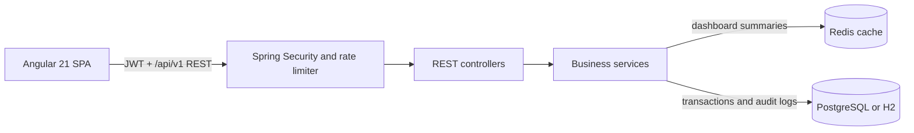

# Car Dealership Management System


[](https://github.com/rupinmunjal/car-dealership-management/actions/workflows/ci.yml)

**Live Demo:** [http://155.248.233.214](http://155.248.233.214)

*Spring Boot · Angular · PostgreSQL · Redis · Docker · Oracle Cloud · GitHub Actions*

A full-stack web application for managing car dealerships with role-based access
control, built with **Spring Boot 3.5** (Java 21) and **Angular 21** (Angular Material).
Designed as a portfolio/showcase project demonstrating JWT authentication,
authorization scoping, package-based limits, and a polished UI.

---

## 👥 Role Model

| Role | Description | Dashboard |
|---|---|---|
| **SITE_ADMIN** | Platform super-admin. Manages all dealers, packages, and can perform any action. | Dealer list, package CRUD, create dealer |
| **DEALER_ADMIN** | Owns one dealership. Manages cars, employees, and dealer settings. | Their dealership's cars, employee management, settings |
| **DEALER_EMPLOYEE** | Works at one dealership. Access scoped by granted permissions (`CAN_ADD_CAR`, `CAN_EDIT_CAR`, `CAN_DELETE_CAR`). | Permission-scoped: UI hides actions the employee can't perform |

**Login flow:** User logs in once → JWT carries their role → Angular route guard
redirects them to the correct dashboard automatically. No manual role selection.

---

## 📦 Package & Permission System

- **SITE_ADMIN** creates subscription **Packages** (e.g. "Starter" with 5 seats, 20 car listings).
- **SITE_ADMIN** assigns a package to each **Dealer** during registration.
- The package enforces:
  - **Max employee seats** — blocks new hires when limit reached (409 Conflict).
  - **Max car listings** — blocks new cars when limit reached (409 Conflict).
- **Package downgrade:** Existing employees are **not** retroactively deactivated.
  Only new hires are blocked. See
  [ADR 0001](docs/adr/0001-preserve-employees-after-package-downgrade.md) for the rationale.
- **DEALER_EMPLOYEE** permissions (`CAN_ADD_CAR`, `CAN_EDIT_CAR`, `CAN_DELETE_CAR`)
  are managed by DEALER_ADMIN through the employee management UI.

---

## 🛠️ Technology Stack

### Backend
- **Java 21** with **Spring Boot 3.5.7**
- **Spring Security** — JWT authentication (jjwt 0.12.6)
- **Spring Data JPA** — Hibernate ORM
- **Spring Data Redis** — five-minute dashboard summary cache
- **H2** (local dev) / **PostgreSQL** (production)
- **Bucket4j** — per-IP API rate limiting
- **Lombok** — boilerplate reduction
- **SpringDoc OpenAPI** (2.8.9) — Swagger UI at `/swagger-ui.html`
- **Micrometer Prometheus registry** — built-in JVM, HTTP, database, and custom application metrics
- **Maven** — build & dependency management

### Frontend
- **Angular 21** with TypeScript 5.9
- **Angular Material 21** — tables, forms, dialogs, sidenav, cards, chips, tooltips
- **RxJS** — reactive state management
- **Angular Router** — role-based route guards
- **Vitest** — unit testing

### DevOps
- **Docker** multi-stage Angular and Spring build
- **Docker Compose** for the application, PostgreSQL, Redis, Prometheus, and Grafana
- **GitHub Actions** — backend tests, Angular build, container build, and GHCR publishing
- **Spring Boot Actuator** — health checks and Prometheus metrics
- **Prometheus + Grafana** — five-second metric scraping and a provisioned Spring Boot dashboard
- **Maven Wrapper** — no Maven install required

---

## 🐳 Quick Start with Docker

### Prerequisite

- Docker Desktop or Docker Engine with Compose

Start the complete application from the repository root:

```bash
docker compose up --build
```

Open **http://localhost:8080**. Docker builds Angular, packages Spring Boot,
starts PostgreSQL and Redis, waits for them to become healthy, and then starts
the application, Prometheus, and Grafana. No local Java, Node.js, Maven, npm,
or PostgreSQL installation is required.

Press `Ctrl+C` to stop the stack. If started in detached mode, stop the
stack with:

```bash
docker compose down
```

PostgreSQL data remains in the `postgres-data` Docker volume. To also erase the
database and return to a first-run state:

```bash
docker compose down --volumes
```

Compose has local demonstration defaults, including
`admin@dealership.local` / `Admin123!`. Create a `.env` file with secure values
before exposing the application outside your machine.

---

## 🐳 Docker Services

| Service | Purpose | Access |
|---|---|---|
| `app` | Angular frontend and Spring Boot API | http://localhost:8080 |
| `database` | PostgreSQL production database | Internal Compose network only |
| `redis` | Dealer dashboard summary cache | Internal Compose network only |
| `prometheus` | Scrapes and stores application metrics | `docker compose port prometheus 9090` |
| `grafana` | Displays the provisioned Spring Boot dashboard | `docker compose port grafana 3000` |

Prometheus and Grafana publish their container ports without fixed host ports.
Docker selects available host ports each time the services are created.

---

## 💚 Health Monitoring

The existing Spring Boot Actuator health endpoint remains available at:

```text
http://localhost:8080/actuator/health
```

Docker uses this endpoint for the application container health check. The
endpoint remains public and retains its existing response and detail settings.

---

## 📊 Observability

Prometheus scrapes `/actuator/prometheus` from the application every five
seconds over the private `app-network`. Grafana uses the provisioned Prometheus
data source and loads Grafana.com dashboard ID 12900, currently titled
**SpringBoot APM Dashboard**, during its first startup.

Built-in Micrometer metrics cover JVM memory and garbage collection, process
uptime, HTTP request rates and latency histograms, HikariCP database pools, and
application logging. The project adds these custom counters:

- `dealership_auth_failures_total` for failed login attempts.
- `dealership_car_mutations_total{operation="create|update|delete"}` for successful car mutations.
- `dealership_dealer_mutations_total{operation="create|update|delete"}` for successful dealer mutations.

Find the dynamically assigned host ports after starting Compose:

```bash
docker compose port prometheus 9090
docker compose port grafana 3000
```

Open the returned Grafana address and log in with the default credentials
`admin` / `admin`. Grafana may ask you to change the password on first login.
Open **Dashboards → Spring Boot → SpringBoot APM Dashboard**, select
`car-dealership-management` in the application filter, and wait for the next
five-second scrape.

To verify Prometheus directly, open `/targets` on the returned Prometheus
address. The `car-dealership-app` target should report `UP` with no scrape
error.

---

## 🔧 Manual Development Setup

### Prerequisites
- **Java 21**
- **Node.js 20+** (only for building the Angular frontend)
- No PostgreSQL needed — local dev uses H2 in-memory.

### 1. Clone & set up environment

```bash
cd car-dealership-management

# Copy the env template
cp .env.example .env

# Generate a real JWT secret:
# sed -i "s|change-me-to-a-real-base64-secret|$(openssl rand -base64 64)|" .env

# Load env vars
set -a && source .env && set +a
```

### 2. Start the backend

```bash
./mvnw spring-boot:run
```

The app starts at **http://localhost:8080** with:
- Angular frontend served from embedded static files
- Swagger UI at http://localhost:8080/swagger-ui.html
- H2 console at http://localhost:8080/h2-console

### 3. Login as SITE_ADMIN

On first boot, the `DataInitializer` creates the platform admin account using
the `SITE_ADMIN_EMAIL` and `SITE_ADMIN_PASSWORD` env vars:

- **Email:** the `SITE_ADMIN_EMAIL` value from `.env`
- **Password:** the `SITE_ADMIN_PASSWORD` value from `.env`

After logging in, you'll be routed to the SITE_ADMIN dashboard.

### Local H2 demo data

The `local` profile also creates three dealerships, ten vehicles, and dealer
accounts for exercising every role and permission path. These records are not
created for the `test` or `prod` profiles. All demo accounts use the
`DEMO_DATA_PASSWORD` value, which defaults to `Demo123!`.

| Account | Role | State |
|---|---|---|
| `maple.admin@demo.local` | Dealer admin | Active |
| `maple.inventory@demo.local` | Employee with all car permissions | Active |
| `maple.sales@demo.local` | Employee with add/edit permissions | Active |
| `lakeshore.admin@demo.local` | Dealer admin | Active |
| `lakeshore.sales@demo.local` | Employee with add permission | Active |
| `harbour.admin@demo.local` | Dealer admin | Suspended dealer |
| `harbour.inventory@demo.local` | Employee with all car permissions | Inactive account |

### 4. Build the frontend (only if you modify Angular code)

```bash
cd src/main/webapp
npm install
npm run build    # builds and copies to src/main/resources/static/
```

The frontend dev server (`npm start` on port 4200) proxies API calls to the
backend via `proxy-conf.json`.

---

## System Architecture



- Angular guards control navigation, while Spring Security remains the source
  of truth for role, dealer, and permission enforcement.
- Controllers validate HTTP input and delegate business rules to services.
- Services enforce package limits and dealer scoping, write audit history, and
  access repositories through Spring Data JPA.
- Redis caches only derived dashboard summaries. PostgreSQL remains the system
  of record, and local development can use H2 without a Redis dependency.

### Performance & Security

- Car, dealer, package, employee, and audit-log collections are paginated, with
  a default page size of 20 and a maximum page size of 100.
- Car inventory supports server-side make, model, year, price, global search,
  and sorting so large datasets are not loaded into the browser.
- Dealer dashboard summaries are cached for five minutes and evicted after car,
  employee, dealer, or package mutations.
- Bucket4j limits API clients to 100 requests per minute per IP and authentication
  endpoints to 10 requests per minute per IP, returning JSON `429` responses.
- JWT authentication is stateless, passwords are BCrypt-hashed, and backend
  authorization tests cover role, permission, and cross-dealer boundaries.
- GitHub Actions runs Maven tests, the Angular production build, and a Docker
  build before publishing main-branch images to GHCR.

The architecture decisions behind package downgrades, JWT authentication, and
Redis cache scope are recorded in [`docs/adr`](docs/adr/).

## 🚀 Deployment

The application is deployed on **Oracle Cloud Infrastructure** (OCI) using:
- Ubuntu 24.04 VM (Always Free tier)
- Docker Compose (Spring Boot + PostgreSQL + Redis + Nginx reverse proxy)
- Nginx reverse proxy routing port 80 → 8080

**Live URL:** http://155.248.233.214

The CI pipeline (GitHub Actions) builds and publishes the Docker image to GHCR on every push to `main`. Deployment is done manually via SSH + `docker compose pull && docker compose up -d`.

---

## 🧪 Testing

```bash
# Run all tests
./mvnw test
```

### Selected test suites

| Suite | Covers |
|---|---|
| `CarPaginationTest` | Paging, sorting, make/model/year/price filters, and dealer scoping |
| `CacheEvictionTest` | Dashboard cache hits and mutation-driven eviction |
| `AuditLoggingTest` | Mutation history, role access, and dealer isolation |
| `RateLimitingTest` | General and authentication endpoint limits and `429` responses |
| `PackageLimitEnforcementTest` | Car limits, seat limits, package downgrade, and deactivated employees |
| `DealerScopingTest` | Cross-dealer isolation and employee permission enforcement |
| `SecurityTest` | Injection resistance, authentication checks, and invalid JWT handling |
| `FunctionalTest` | End-to-end API workflows |
| `JwtServiceTest` | Token generation, validation, and expiry |

---

## 🔒 Environment Variables

| Variable | Required | Description |
|---|---|---|
| `SPRING_PROFILES_ACTIVE` | Yes | `local` (H2 + Swagger) or `prod` (PostgreSQL) |
| `JWT_SECRET` | **Yes** | Base64 secret for JWT signing. Generate: `openssl rand -base64 64` |
| `JWT_EXPIRATION_MS` | No | Token lifetime in ms (default: 86400000 = 24 h) |
| `SITE_ADMIN_EMAIL` | **Yes** | First-run admin account email |
| `SITE_ADMIN_PASSWORD` | **Yes** | First-run admin account password |
| `SPRING_DATASOURCE_URL` | External prod only | PostgreSQL JDBC URL; Compose sets this internally |
| `SPRING_DATASOURCE_USERNAME` | External prod only | Database username; Compose derives this from `POSTGRES_USER` |
| `SPRING_DATASOURCE_PASSWORD` | External prod only | Database password; Compose derives this from `POSTGRES_PASSWORD` |
| `POSTGRES_USER` | Docker only | Postgres container user |
| `POSTGRES_PASSWORD` | Docker only | Postgres container password |
| `POSTGRES_DB` | Docker only | Postgres database name |
| `SPRING_DATA_REDIS_HOST` | External prod only | Redis host; Compose sets this internally |
| `SPRING_DATA_REDIS_PORT` | No | Redis port (default: 6379) |

---

## 🧭 How to Test Each Role Locally

### SITE_ADMIN
1. Start the app → login with the bootstrapped admin credentials.
2. You land on the SITE_ADMIN dashboard.
3. **Create a Package** (e.g. "Starter" with 5 seats, 20 cars).
4. **Register a Dealer** — this creates both the dealer and its first
   DEALER_ADMIN account.

### DEALER_ADMIN
1. Use the credentials from dealer registration (the `adminEmail`/`adminPassword`
   you provided).
2. You land on the DEALER_ADMIN dashboard showing that dealer's cars, employee
   management, and settings.
3. **Create employees** (up to the package seat limit).
4. **Add cars** (up to the package listing limit).

### DEALER_EMPLOYEE
1. Log in with an employee account created by a DEALER_ADMIN.
2. You land on the DEALER_EMPLOYEE dashboard.
3. UI buttons are shown/hidden based on your permissions — e.g. "Add Car" is
   hidden if you lack `CAN_ADD_CAR`.

---

## 📖 API Documentation

- **Swagger UI:** http://localhost:8080/swagger-ui.html (local profile only)
- **Raw OpenAPI:** http://localhost:8080/v3/api-docs

REST endpoints use the `/api/v1` prefix and are grouped into **Auth**, **Cars**,
**Dealers**, **Packages**, **Employees**, and **Audit Logs**.

---

## 📁 Project Structure

```
car-dealership-management/
├── src/main/java/.../
│   ├── beans/          # JPA entities: Car, Dealer, User, Package, Permission, Role
│   ├── config/         # Security, JWT filter, DataInitializer, OpenAPI config
│   ├── controllers/    # REST controllers (Car, Dealer, Employee, Package, Auth)
│   ├── dto/            # Request/Response DTOs with validation
│   ├── exception/      # GlobalExceptionHandler + ApiError
│   ├── mapper/         # Entity ↔ DTO mapping
│   ├── repositories/   # Spring Data JPA repositories
│   └── services/       # Business logic
├── src/main/resources/
│   ├── application.yml           # Base config
│   ├── application-local.yml     # H2, verbose logs, Swagger on
│   ├── application-prod.yml      # PostgreSQL, minimal logs, Swagger off
│   └── static/                   # Built Angular frontend
├── src/main/webapp/              # Angular source
│   └── src/app/
│       ├── pages/                # Login, dashboards (3 roles), forms, tables
│       ├── guards/               # Role-based route guards
│       ├── interceptors/         # JWT injection
│       ├── services/             # Auth, Car, Dealer, Health
│       └── components/           # Shared UI primitives
├── src/test/                     # Backend unit and integration tests
├── docs/adr/                     # Architecture decision records
├── grafana/
│   ├── dashboards/               # Provisioned Grafana.com dashboard 12900
│   └── provisioning/             # Prometheus datasource and dashboard provider
├── prometheus.yml                # Five-second application scrape configuration
├── compose.yaml                  # App + PostgreSQL + Redis + observability stack
├── Dockerfile                    # Multi-stage build (Angular → Maven → JRE)
└── .env.example                  # Environment variable template
```

---

## 🎯 Project Purpose

This project is deployed live and demonstrates production-oriented full-stack engineering including RBAC, secure REST APIs, relational persistence, Redis caching, audit logging, rate limiting, automated CI/CD, and containerized cloud deployment.

## 👥 Authors

- **Rupin Munjal**
- **Amninder Kaur**
